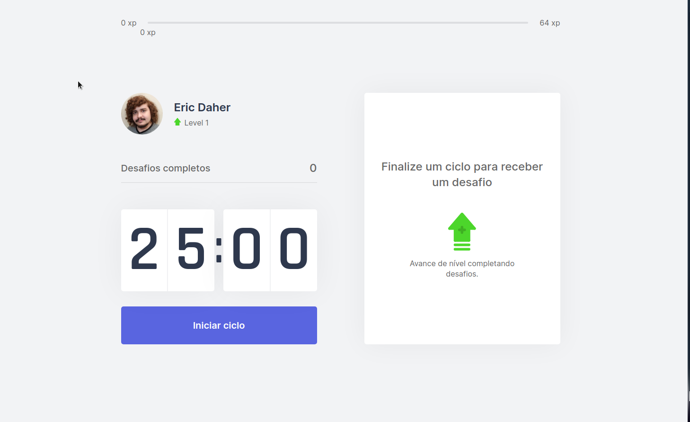

<h1 align="center">move.it</h1>

<p>This project made during RocketSeat's NLW#04, using React and TypeScript. It's an application that helps you focus while working, using the Pomodoro technique - and when the timer ends, it suggests an exercise for your body or your eyes, so you can be productive and still take care of your health.</p>

<h1 align="center">
  
</h1>

<h4 align="center">Technology</h4>
<p>move.it was made using with <a href="https://nextjs.org/">Next.js</a> (which uses React) and <a href="https://www.typescriptlang.org/">TypeScript</a>.</p>

<h4 align="center">Status</h4>
<p>This is a work in progress. The basic funcionality is done - but some things that could be implemented, like leaderboards, achievements or even storing user progress with something more permanent than cookies still needs to be done. There's <strong>no</strong> guarantee that will happen, though.</p>

<h4 align="Center">Running and live demo</h4>
<p>You'll need Node.js and npm installed for this project. If you just want to see what it looks like in action, you can click <a href="https://nlw4-moveit-seven.vercel.app/">here</a>.</p>
<p>If you want to run it locally:</p>

```bash
# Clone repository
$ git clone https://github.com/ericdaher/nlw4-moveit

# Go to folder
$ cd nlw4-moveit

# Install dependencies
$ npm install

# Run application
$ npm run dev
```
